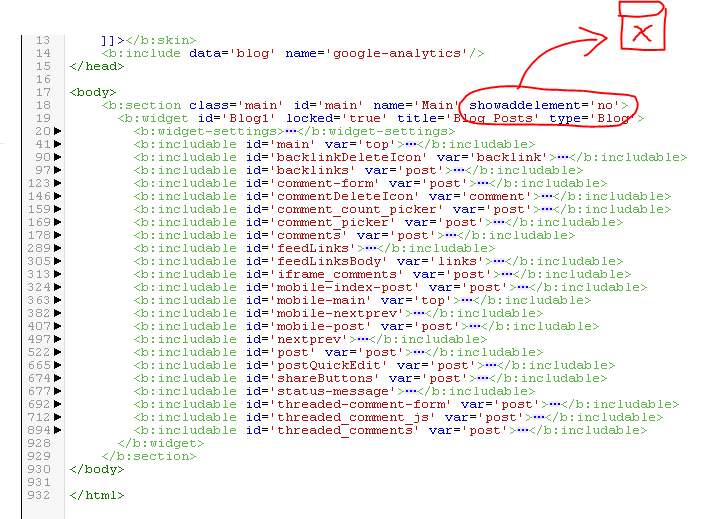

### Blogger

[Blogger](https://www.blogger.com) là 1 trong những blog platform lâu đời nhất thuộc sở hữu của Google. Cho tới nay blogger không hẳn là 1 **blogging service** tốt nhất nhưng mình vẫn dành nhiều thiện cảm cho nó nhất.

> Blogger vẫn hay được gọi là blogspot vì 1 blog được host dưới dạng subdomain của blogspot.com.

Mình chưa thử nhiều các [blogging services](http://www.creativebloq.com/web-design/best-blogging-platforms-121413634) khác (wordpress, medium, ghost...) nên không thể có 1 sự so sánh chính xác, và đôi khi người ta thường nói, anh [Page](https://en.wikipedia.org/wiki/Larry_Page) thích thì ảnh shutdown cái blogger, mặc cho hàng triệu người đang xài ngoài kia. Nên, nếu bạn muốn chọn 1 services "tốt" thì mình không nghĩ nó là blogger.

Có thể liệt kê 1 số ưu điểm và khuyết điểm của blogspot như sau:

#### Ưu:

- Miễn phí, không giới hạn số bài post.
- Dễ sử dụng (hàng của google bao giờ cũng dễ sử dụng).
- Tích hợp sẵn AdSense, 1 dịch vụ kiếm tiền bằng quảng cáo khá phổ biến.
- Và mới đây (2016), blogspot đã chính thức hỗ trợ https.

#### Khuyết:

- Kho giao diện dựng sẵn không phong phú.
- Ít widget/plugins (vãi, toàn mấy cái chính để lôi kéo blogger).
- Và nguy hiểm nhất là bạn có thể xài tốt hôm nay, ngày mai bạn sẽ nhận được 1 email từ google có nội dung đại loại: "chúng tôi sẽ tạm ngưng dịch vụ blogspot từ ngày x/y/z, hãy chắc chắn dữ liệu của bạn đã được backup để tránh mất mát bla bla..." :v

Mặc định khi tạo blogspot, bạn có thể chọn những template có sẵn (blogspot vừa thêm vài templates hôm 21/3/2017, nhìn phong cách và mobile friendly nhiều hơn so với các template củ chuối trước kia). Tuy nhiên, nếu chưa hài lòng với những cái có sẵn, bạn hoàn toàn có thể custom template để nó như ý muốn của mình.

Với 1 tình yêu dành cho blogspot, và để giúp đỡ những ai yêu thích blogspot, trong bài post này mình sẽ hướng dẫn cách custom template blogspot để có 1 giao diện theo ý mình nhất.

### Require & Prepair

Nếu bạn chọn những template có sẵn, bạn không cần phải biết gì cả. Nhưng để custom được, bạn cần phải có những yếu tố sau:

0. Biết kiên nhẫn.
1. Biết html/css/xml.
2. Biết javascript (nếu bạn muốn viết thêm js).
3. Biết tư tưởng lập trình (chủ yếu là if/else).
4. Biết inspect element.

Và chuẩn bị một số công cụ:

1. Code editor (không cần phải IDE, mình sử dụng [VSCode](https://code.visualstudio.com/))
2. Git (optional - để xem bạn đã thay đổi những gì)

### Tư tưởng làm việc

compare (1) -> edit template -> save template -> refresh browser -> inspect element (2) -> styling -> compare

Trong đó:

- (1): so sánh với những thay đổi trước đó (lỡ như bạn xóa nhầm), đây là lúc mà git phát huy tác dụng.
- (2): kiểm tra phần tử được generated ra và tìm nơi sửa trong template.

Ok, bắt tay vào làm nhé.

### Minimal setup

Sau khi vào blogger.com, [tạo 1 blog](https://support.google.com/blogger/answer/1623800?hl=en) với url mà bạn muốn, next next vài lần. Sau khi tạo thành công, mở Themes > Edit HTML để bắt đầu custom.

Bạn sẽ choáng với cái đống giống html-xml trong đó, cứ bình tĩnh. Copy nó cho vào editor của bạn để backup.

Và đây là yêu cầu tối thiểu của 1 template:

Có 2 thành phần bắt buộc trong 1 template, đó là skin (`<b:skin>`) và section (`<b:section>`). Skin dùng để chứa css (bạn cũng có thể viết trong cặp thẻ `<style>` như thường), và widget (là cái mà sẽ hiển thị dữ liệu) chỉ có thể được chứa trong section mà thôi.

Khi bạn copy đống này bỏ lại vào template, save và refresh lại trang, một số thành phần sẽ được generate ra:

Tuy nhiên, nếu bạn tạo 1 vài bài viết (post) thì nó sẽ không hiển thị lên. Lúc này bạn chỉ cần xóa attribute `showaddelement='no'`, mọi chuyện sẽ ok.

Ok, đến lúc giải thích 1 số thứ rồi:

1. Ngôn ngữ được sử dụng trong blogspot template có thể được gọi là blogger language, 1 thứ trộn lẫn giữa cấu trúc html và xml, cùng với 1 số syntax quy định của blogspot. Do đó bạn hoàn toàn có thể viết 1 web tĩnh chỉ chứa html bằng blogspot.
2. Các thẻ (mà không phải html tag), được xem là 1 element `<b:section>`. Mỗi element đó đều có các thuộc tính (attribute) đi kèm `<b:section class='main'>`. Các giá trị này phụ thuộc vào element đó, và bạn có thể xem tại [đây](https://support.google.com/blogger/answer/46888?hl=en&ref_topic=6321969) để biết thêm.
3. Và cho dù element đó có là gì đi nữa, thì cuối cùng nó vẫn phải render ra html mà thôi (hình dưới).

Giờ chỉ việc hiểu các rule hiển thị và custom nó mà thôi, đơn giản nhỉ :))

### Rule 1: Luôn luôn backup những gì bạn đã làm

bằng cách sử dụng git (nếu bạn là 1 dev), với những người không phải developer thì bạn có thể lưu file template cũ riêng ra, sau khi sửa thì tiếp tục lưu riêng ra. Chắc chắn sẽ có lúc bạn "vô tình" sửa 1 cái gì đó làm cho cái template loạn lên, đó là lúc bản backup phát huy tác dụng.

### Rule 2: Widget chỉ nằm trong Section.

Giả sử bạn viết 10 bài viết (post), thì widget "Blog" `<b:widget type='Blog'>` là cái sẽ hiển thị 10 post đó ra.

Giả sử bạn muốn hiển thị danh sách nhãn (tag/label) của blog, thì widget Label `<b:widget type='Label'>` sẽ hiển thị danh sách nhãn ra.

Và tất cả các widget đó phải được đặt trong thẻ section, bạn có thể có nhiều thẻ section, cũng như là có thể có nhiều widget trong 1 section, số lượng giới hạn tùy bạn set.

Sẽ có chỗ để bạn thêm các widget, mình sẽ nói tới nó sau.

### Rule 3: Tái sử dụng với includable và include.

Hãy liên tưởng tới hàm (method/function). Khi khai báo `<b:includable id='main'>` tức là bạn khai báo 1 function, và khi bạn muốn sử dụng hàm "main" trên, bạn chỉ việc `<b:include name='main'/>`.

Cụ thể, Xét 1 view trên blog của mình:

Sẽ có nhiều chỗ bạn cần sử dụng cái hiển thị cái title này, khi đó nếu bạn sử dụng includable thì nó sẽ đại loại như sau (diễn tả thôi nhóe):

Như vậy, bạn có thể include nhiều cái "postTitle" trong post, và nó sẽ hiển thị ra hoàn toàn như nhau.

Chính vì khả năng tái sử dụng mà trong template bạn sẽ thấy rất nhiều chỗ sử dụng includable và include:

Ok, chỉ có 3 rules vậy thôi.

Xem thêm tại [đây](https://support.google.com/blogger/answer/46995) để biết các widget tags khác, mình sẽ giải thích thêm trong khi sử dụng.