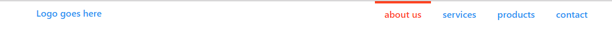
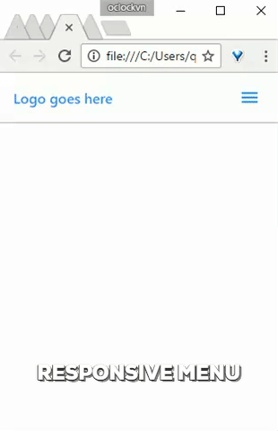
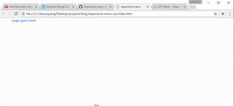

reponsive menu css

Ây da, dạo này đầu óc cứ quay cuồng với nhiều thứ. Để tĩnh tâm thì đành viết 1 cái gì đó đơn giản ra, nghĩ đi nghĩ lại thì nghĩ tới cái chủ đề này :)

Ok, chủ đề của bài viết này là tạo ra menu responsive, hay còn gọi là menu "thân thiện với môi trường", à nhầm, thân thiện với mobile.

### HTML

### CSS

> Để hiểu về flex, bạn tham khảo tại [đây](https://css-tricks.com/snippets/css/a-guide-to-flexbox/)

Kết quả:

### Responsive

Đơn giản thôi, khi thu nhỏ kích thước màn hình lại thì có 2 điều cần làm là hiển thị hamburger menu button và ẩn cái menu đi. Css cập nhật lại như sau (style 1 tí cho cái `.toggle-menu`):

### Toggle event

Kết quả:

### Vấn đề

Vấn đề xảy ra theo các bước sau:

1. Ở desktop
2. Thu nhỏ mản hình xuống mobile => ẩn menu (bằng css: `display: none;`)
3. Click hamburger button => hiển thị menu (bằng js inline style)
4. Click tiếp hamburger button => ẩn menu (bằng js display none)
5. Mở trình duyệt lại kích thước desktop => menu không hiển thị.

Nguyên nhân là do hàm `toggle()` của jquery đã set inline style cho menu:

#### Giải quyết vấn đề:

Trong hàm `slideToggle()` truyền vào 2 tham số là duration và callback function. Callback được gọi sau khi slide animation kết thúc, mình gỡ inline style ra khỏi menu và set cho nó 1 class mới để hiển thị khi ở mobile.

Sửa lại css 1 chút như sau:

Và hoooo, ngon cơm :)

Bạn có thể xem source tại [đây](https://github.com/oclockvn/blog/tree/master/responsive-menu-css).